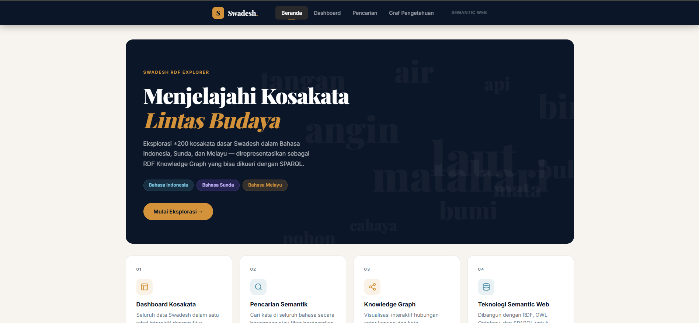
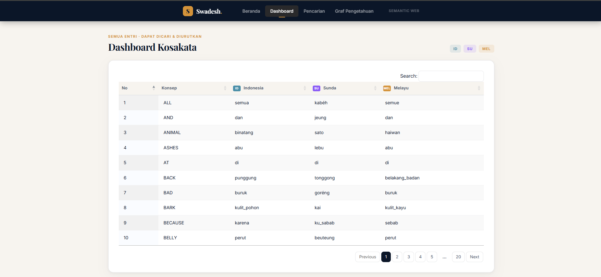
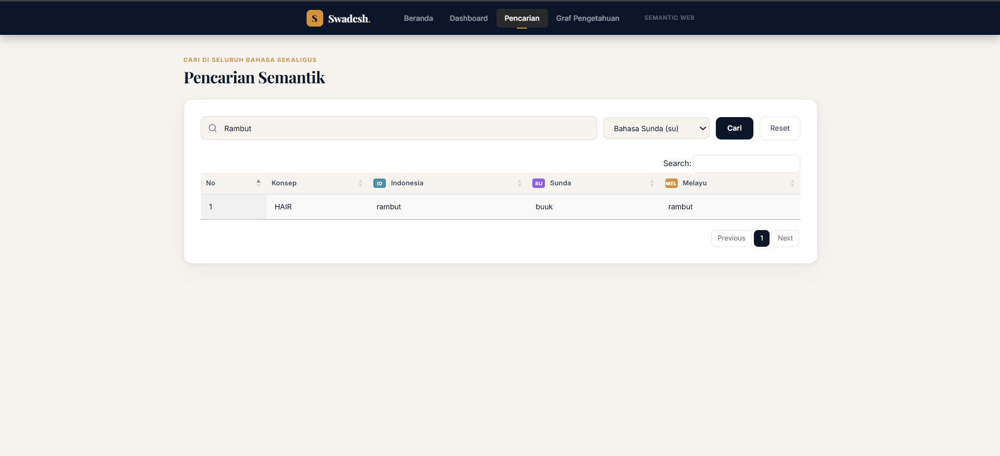
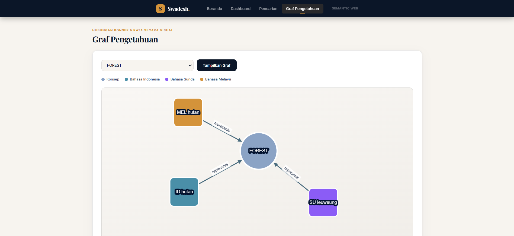

# Swadesh RDF Explorer

> Jelajahi kosakata lintas budaya dengan teknologi Semantic Web — Bahasa Indonesia, Sunda, dan Melayu dalam satu platform interaktif.

---

## Deskripsi

**Swadesh RDF Explorer** adalah aplikasi web berbasis *Semantic Web* yang mengeksplorasi **Daftar Swadesh** — sekumpulan kosakata dasar yang digunakan dalam linguistik komparatif — untuk tiga bahasa serumpun: **Bahasa Indonesia**, **Bahasa Sunda**, dan **Bahasa Melayu**.

Data kosakata dimodelkan menggunakan **ontologi OWL/RDF** dan disimpan di **Apache Jena Fuseki** sebagai *triplestore*. Backend Flask mengirimkan query **SPARQL** ke Fuseki untuk mengambil data secara semantik, lalu menyajikannya lewat API REST yang dikonsumsi oleh frontend web.

### Fitur Utama

| Fitur | Deskripsi |
|---|---|
| **Dashboard Kosakata** | Tabel interaktif seluruh data Swadesh (hingga 200 entri) dengan pencarian lokal dan pagination via DataTables |
| **Pencarian Semantik** | Cari kata di semua bahasa sekaligus (case-insensitive) atau filter per bahasa tertentu |
| **Knowledge Graph** | Visualisasi interaktif relasi konsep–kata menggunakan Cytoscape.js |
| **Multi-bahasa** | Mendukung Bahasa Indonesia (`id`), Bahasa Sunda (`su`), dan Bahasa Melayu (`mel`) |

---

## Struktur Proyek

```
swadesh-rdf-sparql-app/
├── backend/
│   └── app.py                  # Flask API (SPARQL endpoints)
├── data/
│   └── Dataset_Swadesh.csv     # Dataset kosakata Swadesh (sumber)
├── frontend/
│   ├── index.html              # Halaman utama aplikasi
│   ├── app.js                  # Logika frontend
│   ├── styles.css              # Tampilan antarmuka
│   └── serve_frontend.py       # Server statis sederhana
├── images/                     # Screenshot aplikasi (untuk dokumentasi)
│   ├── 01-beranda.png
│   ├── 02-dashboard.png
│   ├── 03-pencarian.png
│   └── 04-graf.png
└── ontology/
    ├── generate_ontology.py    # Script konversi CSV → RDF/TTL
    ├── swadesh_ontology.owl    # Skema ontologi
    ├── swadesh_ontology.ttl    # Skema ontologi dalam format Turtle
    └── swadesh_data.ttl        # Data RDF hasil konversi
```

---

## Teknologi

- **Backend:** Python, Flask, Flask-CORS
- **Triplestore:** Apache Jena Fuseki
- **Query Language:** SPARQL
- **Ontologi:** OWL / RDF (Turtle format)
- **Frontend:** HTML, CSS, JavaScript, Bootstrap 5
- **Visualisasi Graf:** [Cytoscape.js](https://js.cytoscape.org/)
- **Tabel Interaktif:** [DataTables](https://datatables.net/)

---

## Panduan Instalasi

### Prasyarat

Pastikan perangkat sudah memiliki:

- **Python 3.x** — [python.org/downloads](https://www.python.org/downloads/)
- **Apache Jena Fuseki** — [jena.apache.org](https://jena.apache.org/documentation/fuseki2/)
- **Java 11+** (diperlukan untuk menjalankan Fuseki)

Install dependensi Python:

```bash
pip install flask flask-cors requests
```

---

### Langkah 1 — Siapkan Triplestore (Apache Jena Fuseki)

1. Ekstrak Apache Jena Fuseki, lalu jalankan dari direktori instalasinya:

   ```bash
   ./fuseki-server --update --mem /swadesh
   ```

   Fuseki akan berjalan di `http://localhost:3030`.

2. Buka `http://localhost:3030` di browser.

3. Buat dataset baru bernama **`swadesh`** melalui tab **Manage Datasets → Add new dataset**.

4. Upload data RDF ke dataset tersebut:
   - Buka tab **Upload data** pada dataset `swadesh`
   - Pilih file berikut dari folder `ontology/`:
     - `swadesh_data.ttl`
     - `swadesh_ontology.ttl`
   - Klik **Upload**

---

### Langkah 2 — Jalankan Backend Flask

```bash
cd backend
python app.py
```

Backend akan berjalan di `http://localhost:5000`.

Verifikasi dengan membuka: `http://localhost:5000/health`

Response sukses:
```json
{
  "backend": "ok",
  "fuseki": "ok"
}
```

---

### Langkah 3 — Jalankan Frontend

```bash
cd frontend
python serve_frontend.py
```

Browser akan otomatis membuka `http://127.0.0.1:8000/index.html`.

Atau jalankan secara manual:

```bash
cd frontend
python -m http.server 8000
```

Lalu buka `http://127.0.0.1:8000/index.html` di browser.

---

### Urutan Menjalankan (Ringkasan)

```
1. Jalankan Fuseki  →  http://localhost:3030
2. Jalankan backend →  http://localhost:5000
3. Jalankan frontend → http://localhost:8000
```

Ketiga layanan harus berjalan bersamaan agar aplikasi berfungsi penuh.

---

## Panduan Pengguna

### Halaman Beranda

Halaman pertama yang muncul saat aplikasi dibuka. Berisi ringkasan proyek dan tombol **Mulai Eksplorasi** untuk langsung masuk ke Dashboard.

---

### Dashboard Kosakata

Menampilkan seluruh 200 entri kosakata Swadesh dalam tabel interaktif.

- **Pencarian lokal:** Gunakan kotak pencarian di pojok kanan atas tabel untuk memfilter baris secara langsung
- **Pengurutan:** Klik header kolom untuk mengurutkan data (ascending/descending)
- **Pagination:** Navigasi antar halaman data menggunakan tombol di bawah tabel

---

### Pencarian Semantik

Mencari kata di seluruh bahasa menggunakan query SPARQL ke Fuseki.

1. Ketik kata pada kolom **pencarian** (contoh: `air`, `kabéh`, `semua`)
2. Opsional: pilih bahasa tertentu pada dropdown filter (**Bahasa Indonesia / Sunda / Melayu**)
3. Klik tombol **Cari**
4. Hasil akan muncul dalam tabel di bawahnya
5. Klik **Reset** untuk menghapus filter dan menampilkan ulang semua data

> Pencarian bersifat *case-insensitive* dan mencakup kata dari semua bahasa secara bersamaan jika filter bahasa tidak dipilih.

---

### Graf Pengetahuan

Visualisasi interaktif hubungan antara konsep dan kata dalam setiap bahasa.

1. Pilih konsep dari dropdown (contoh: `ALL`, `air`, `tangan`)
2. Klik tombol **Tampilkan Graf**
3. Graf akan merender node dan edge secara otomatis

Arah panah menunjukkan relasi **"represents"** — artinya kata tersebut merepresentasikan konsep yang dimaksud.

---

## Contoh Hasil

### Beranda



Tampilan awal aplikasi dengan hero section dan navigasi ke fitur-fitur utama.

---

### Dashboard Kosakata



Tabel interaktif yang memuat 200 entri kosakata Swadesh dalam tiga bahasa, dilengkapi fitur pencarian dan pengurutan kolom.

---

### Pencarian Semantik



Hasil pencarian kata menggunakan query SPARQL. Pengguna dapat memfilter berdasarkan kata kunci maupun bahasa tertentu.

---

### Graf Pengetahuan



Visualisasi relasi konsep–kata dalam bentuk Knowledge Graph. Node berwarna membedakan bahasa, dan panah menunjukkan relasi semantik antar node.

---

## API Endpoints

| Method | Endpoint | Deskripsi |
|---|---|---|
| `GET` | `/get-data` | Ambil seluruh kosakata (maks. 200) |
| `GET` | `/search?keyword=<kata>` | Cari kata di semua bahasa |
| `GET` | `/filter?lang=<kode>` | Filter per bahasa (`id` / `su` / `mel`) |
| `GET` | `/graph-data` | Data node & edge untuk Knowledge Graph |
| `GET` | `/concepts` | Daftar semua konsep yang tersedia |
| `GET` | `/languages` | Daftar bahasa yang didukung |
| `GET` | `/health` | Health check backend & Fuseki |

---

## Anggota Proyek

Proyek Tugas Akhir Mata Kuliah **Semantic Web** — Universitas Padjadjaran

| NPM | Nama |
|---|---|
| 140810230025 | Kresna Bayu Wicaksono |
| 140810230039 | Naqiyyah Zhahirah |
| 140810230063 | Shofy Aliya |

---

## Repository

[https://github.com/NaqiyyahZhahirah/swadesh-rdf-sparql-app](https://github.com/NaqiyyahZhahirah/swadesh-rdf-sparql-app)